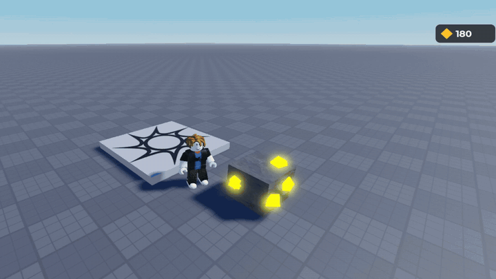
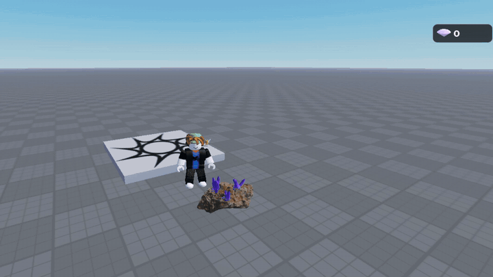
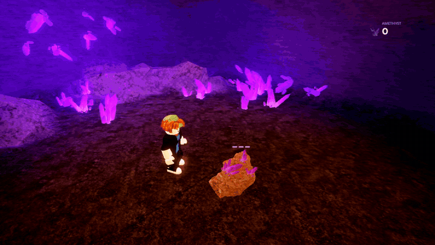
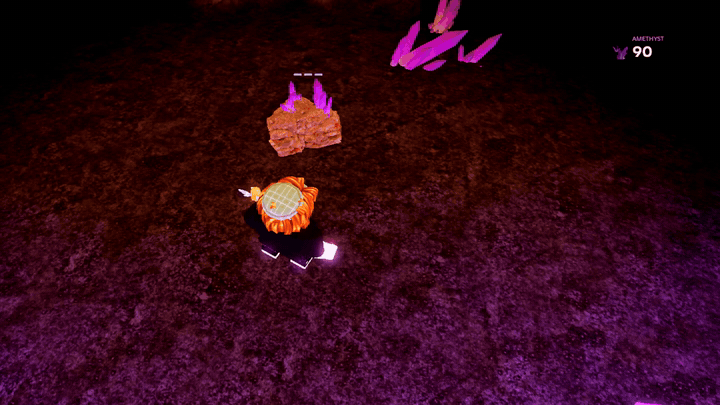
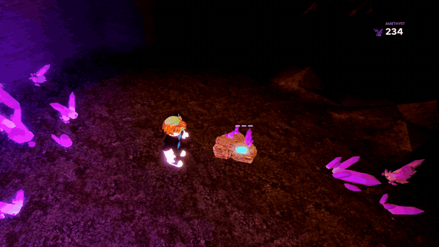
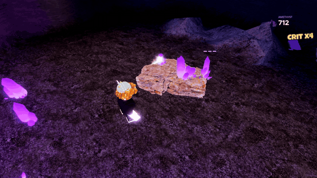
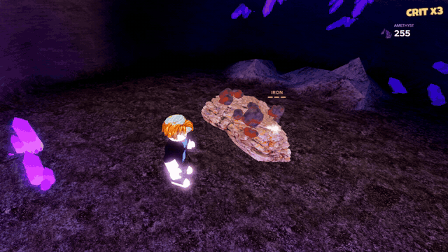

# progress

recorded in studio as i go, newest at the bottom

### 01 · first burst

click the rock and 14 bits of gold pop out, hang in the air for a moment, then turn into flat diamonds on the screen and curve into the counter. the counter goes up one per piece and does a little pop each time. rock comes back after a second

### 02 · heavier break

the rock shakes and swells for a split second and goes white before it pops, then there's a white puff where it was and the camera kicks. same burst as before but it feels like you actually hit something now

### 03 · drop, bounce, magnet

threw the explosion out, it wasn't satisfying. now the rock crumbles into rubble that tumbles and fades, the gold comes out as gems of 3 sizes that bounce on the ground, sit for a beat, then get pulled into you one after another with a trail. each one hops onto the screen and into the counter, which rolls up with a +30 under it. still placeholder cubes, real assets next

### 04 · real assets

swapped the cubes for proper models off the creator store. dark low poly rock with bits of ore in it, purple cut gems in 3 sizes, and the rubble is random rocks out of a 49 piece rock pack so no two breaks look the same. the counter icon and the bits flying into it are the actual gem now, rendered in 3D. store models come in at any size (the gem was 23 studs across) so everything gets scaled to fit. one free nugget model i tried had hidden scripts in it, so that one's gone

### 05 · scanned rock, real crystals

the store models looked cheap so i rebuilt everything. first try was a rock made from maths in blender and it looked like play dough in game. now the rock is a real photogrammetry scan (boulder 01 off poly haven, cc0) cut down to 16.5k tris with its scanned textures, and the amethyst is modelled from scratch: tapered six sided crystals with growth ridges and bevelled edges, a bed of little ones round the base, dark violet at the tips. gems sparkle when they land and bob while they wait. also fixed the whole rock being tipped 90 degrees, blender's Z-up leaves the pivot rotated when you import

### 06 · crystal cave

gave it a proper set to show it off: a cave carved out of terrain with a shaft in the roof, amethyst growing out of the walls and two lanterns either side of the rock. the drops are chunks of the rock's own amethyst now instead of a cartoon cut gem, and they don't turn into flat squares any more, the actual crystal flies up into the counter and shrinks into it. counter lost its box too, it's just the amethyst, a caption and the number. two bugs on the way: the rock landed on the cave roof because it looked for the ground from the sky, and no wall crystals showed up because terrain isn't solid for a moment after you make it

### 07 · three hits

the rock takes three hits now instead of one click. the first two give a softer tink, the rock dips and springs back, a few chips knock off it and a little amethyst spills out. third hit breaks it and drops the rest. three little marks over the rock show how many hits are left. also took the lamp posts out, the warm light on the rock is just a hidden light now

### 08 · hits land where you click

chips, a puff of rock dust and the little bit of amethyst all come off the spot you actually clicked now, flying out from that face, instead of popping out of random places on top. the last hit throws a bigger slower cloud as it crumbles. dust uses roblox's own smoke texture with no glow so it stays dust in the dark

### 09 · weak point, hit numbers, loot beams

three fortnite-ish bits at once. a glowing cyan weak point sits on the rock facing you and jumps somewhere new after every hit, hitting it is a crit worth 3x with a sharper tink, more chips and dust and a harder wobble. every hit pops a chunky number, white normally, cyan on a crit, gold on the break. and the drops roll rarity now, green blue purple and the odd gold legendary, and anything above common stands a beam of light up off the ground until you pull it in

### 10 · crit streak

weak-point hits in a row stack a multiplier, x2 x3 up to x4, shown under the counter and carried from one rock to the next. any normal hit breaks it and the label drops away. the crit ding climbs in pitch as the streak goes up

### 11 · sharper rock, ten more of them, a rust-style weak point

the rock still looked low res up close because roblox caps a texture at 1024 and that was stretched over a 9 stud rock. so it's cut into four quarters now, each with its own 1024 texture baked from the full 66k tri scan, about four times the detail. then ten variants for a level: the same scan bent and stretched differently with its own amethyst, and they all share those four textures. a random one grows back each time. the weak point lost the blue circle, it's a warm glint in the stone now with little sparks spitting out and falling, like rust

### 12 · coal, iron, gold, diamond

rocks roll an ore now: coal is common, iron less so, amethyst, then rare gold and very rare diamond, each worth more than the last. the ore clusters are modelled in blender (tools/blender/ores.py): coal and iron are angular broken lumps, gold is rounded pitted nuggets in real metal, diamonds are rough octahedra done as roblox glass. they get set into the rock where it faces out, the name shows over the hit marks, the right nuggets fly out, and the counter turned into a resource list with a row for each ore. first bake turned the gold black, turns out a diffuse colour bake of a metal is just black

