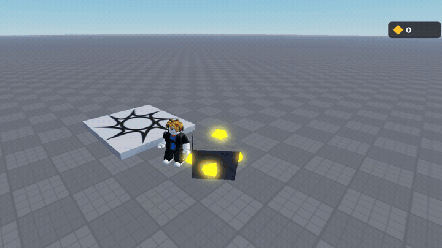

# progress

recorded in studio as i go, newest at the bottom

### 01 · first burst

click the rock and 14 bits of gold pop out, hang in the air for a moment, then turn into flat diamonds on the screen and curve into the counter. the counter goes up one per piece and does a little pop each time. rock comes back after a second

### 02 · heavier break

the rock shakes and swells for a split second and goes white before it pops, then there's a white puff where it was and the camera kicks. same burst as before but it feels like you actually hit something now

