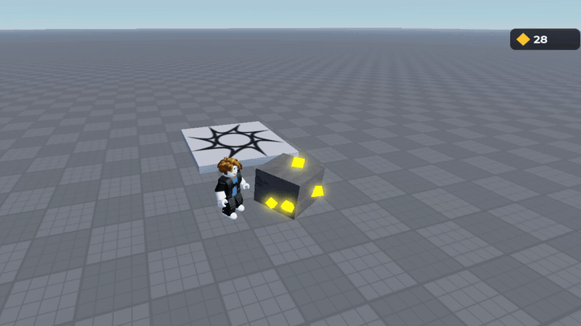

# collect-burst

the "ore breaks and flies into your counter" effect for roblox.

`rojo serve` or paste src/CollectBurst.luau into a ModuleScript in ReplicatedStorage and src/Demo.client.luau into a LocalScript in StarterPlayerScripts, then hit play and click the rock.

wip, see [PROGRESS.md](PROGRESS.md) for how it got here
