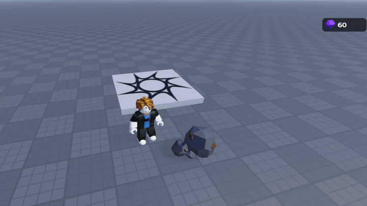

# collect-burst

the "ore breaks and flies into your counter" effect for roblox. the rock crumbles, gems bounce out, get pulled into you and fly into the counter.

`rojo serve` or paste src/CollectBurst.luau into a ModuleScript in ReplicatedStorage and src/Demo.client.luau into a LocalScript in StarterPlayerScripts, then hit play and click the rock.

to use your own stuff make a folder `CollectBurstAssets` in ReplicatedStorage. everything's optional, missing ones fall back to placeholders:

- `Rock` model or meshpart, any size
- `Gem` model or meshpart, any size. also used as the 3D counter icon
- `Chunk` a part, or a model full of rocks to pick from for the rubble
- `Pickup` and `Break` sounds
- `Icon` a decal, if you'd rather have a flat icon than the 3D gem

the gif uses these free ones from the creator store:

| | asset | id |
|---|---|---|
| Rock | rock with ore | 4643875619 |
| Gem | gem | 9180567487 |
| Chunk | Stylized Rock Pack | 139056934028989 |
| Pickup | Pickup Coin Doors SFX | 91478228840490 |
| Break | Rock Hits Rock On Rock | 9118608146 |

check free models for scripts before you use them, one nugget i tried had a backdoor in it

wip, see [PROGRESS.md](PROGRESS.md) for how it got here
