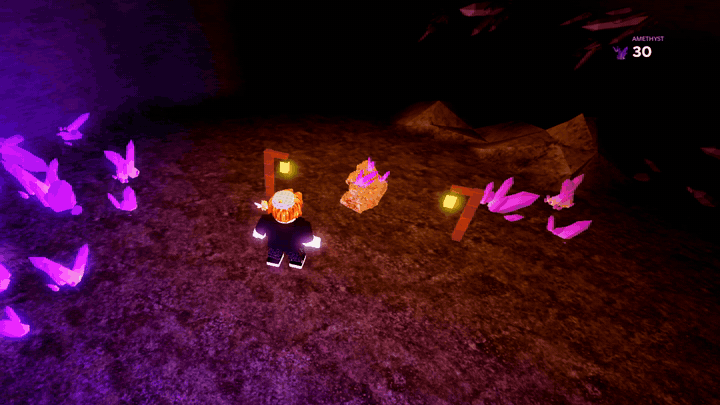

# collect-burst

the "ore breaks and flies into your counter" effect for roblox. the rock crumbles, gems bounce out, get pulled into you and fly into the counter.

`rojo serve` or paste src/CollectBurst.luau into a ModuleScript in ReplicatedStorage and src/Demo.client.luau into a LocalScript in StarterPlayerScripts, then hit play and click the rock. src/Scene.server.luau is optional, put it in ServerScriptService for the cave set in the gif

to use your own stuff make a folder `CollectBurstAssets` in ReplicatedStorage. everything's optional, missing ones fall back to placeholders:

- `Rock` model or meshpart, any size
- `Gem` model or meshpart, any size. also used as the 3D counter icon
- `Chunk` a part, or a model full of rocks to pick from for the rubble
- `Pickup` and `Break` sounds
- `Icon` a decal, if you'd rather have a flat icon than the 3D gem

the rock, crystals, gem and rubble in the gif are in `assets/collect_burst_assets.fbx`. import it with File > Import 3D, then run `tools/roblox/import_setup.luau` in the command bar and it sorts everything into `CollectBurstAssets`. `tools/blender` has the scripts that made them, see `assets/CREDITS.md`

wip, see [PROGRESS.md](PROGRESS.md) for how it got here
